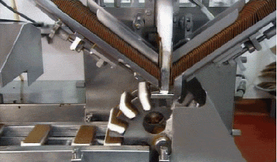
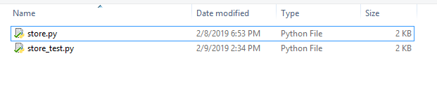
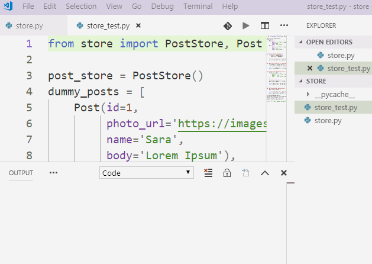

## مصنع الآيس كريم !

أنت ترى مصنع الآيس كريم بالأعلى (قد تأخذ الصورة بعض الوقت لتظهر), ما نريد القيام به الآن هو عمل شيء مشابه ولكن للمنشورات Posts التي لدينا.

لدينا هذا الكلاس حالياً:

```python
class Post:
    def __init__(self, id, photo_url, name, body):
        self.id = id
        self.photo_url = photo_url
        self.name = name
        self.body = body
```

ولكن نريد كلاس آخر يقوم بما يقوم به مصنع الآيس كريم... إضافة, قراءة, تعديل, وحذف العناصر.

سنقوم بعمل كلاس PostStore (مستودع للمنشورات), وظيفته القيام بهذه المهام.

## لكن, كيف سنحتفظ بالبيانات ؟ باستعمال قاعدة بيانات ؟

لا, أبداً !

حالياً لا نريد الكثير من التعقيدات, لذا **سنستخدم فقط list** (قائمة) للإحتفاظ بالـ posts وسيقوم المستودع بالتعامل مع هذه القائمة.

## لما لا تقوم بقية المواقع باستعمال list ؟

لأن الـ list تعمل في ذاكرة الحاسب الآلي, بمعنى حينما تقوم بإغلاق التطبيق, **سينحذف كل شيء**, ولكن كما أخبرتك لنجعل الأمور سهلة قدر الإمكان سنستعمل list.

## مالذي لدينا داخل PostStore (مستودع المنشورات) ؟

لدينا الدوال التالية:

```python
class Post:
    def __init__(self, id, photo_url, name, body):
        self.id = id
        self.photo_url = photo_url
        self.name = name
        self.body = body

posts = []

class PostStore:
    def get_all(self):
        # get all posts - الحصول على كل المنشورات

    def add(self, post):
        # append post - إضافة منشور

    def get_by_id(self, id):
        # search for post by id - id البحث عن منشور بالمعرف

    def update(self, id, fields):
       # update post data - id تعديل منشور بالمعرف

    def delete(self, id):
        # delete post by id - id حذف منشور بالمعرف
```

هذه الدوال مشابهه جداً للعمليات التي عرفناها سابقاً CRUD - Create Read Update Delete :wink: 

بإمكانك نسخ هذه الأكواد إلى ملف اسمه store.py.

## ماهي المهمة المطلوبة ؟

قم بملئ أكواد الدوال بالأعلى, بحيث تقوم كل دالة بوظيفتها حسب الوصف بداخلها.

## كيف أجرب الحل خاصتي ؟

قمنا بكتابة اختبارات للأكواد tests, وفي حالة كانت أكواد تعمل بشكل سليم ستظهر الرسالة All tests passed successfully

قمت بحفظ هذه الأكواد في ملف اسمه store_test.py

```python
from store import PostStore, Post

post_store = PostStore()
dummy_posts = [
    Post(id=1,
         photo_url='https://images.pexels.com/photos/415829/pexels-photo-415829.jpeg?auto=compress&cs=tinysrgb&dpr=2&h=50&w=50', 
         name='Sara', 
         body='Lorem Ipsum'),
    Post(id=2,
         photo_url='https://images.pexels.com/photos/736716/pexels-photo-736716.jpeg?auto=compress&cs=tinysrgb&dpr=1&h=100&w=100', 
         name='John', 
         body='Lorem Ipsum'),
]


def store_should_add_posts():
    for post in dummy_posts:
        post_store.add(post)
    
    # check if posts list has same length as dummy_posts list
    assert len(post_store.get_all()) == len(dummy_posts)


def get_by_id_should_retrieve_same_object():
    second_post = dummy_posts[1]
    retrieved_second_post = post_store.get_by_id(2)

    assert second_post is retrieved_second_post


def update_should_modify_object():
    fields_to_update = {
        'photo_url': 'https://images.pexels.com/photos/415829/pexels-photo-415829.jpeg?auto=compress&cs=tinysrgb&dpr=2&h=750&w=1260',
        'name': 'Alex', 
        'body': 'Interesting topic right here!'
    }

    # update second post
    post_store.update(2, fields_to_update)
    
    assert post_store.get_by_id(2).name == 'Alex'
    assert post_store.get_by_id(2).body == 'Interesting topic right here!'


def delete_should_remove_object():
    post_store.delete(2)

    assert len(post_store.get_all()) == 1
    assert post_store.get_all()[0].id == 1

store_should_add_posts()
get_by_id_should_retrieve_same_object()
update_should_modify_object()
delete_should_remove_object()

print('All tests passed successfully!')
```

لتشغيل هذه الاختبارات ببساطة تقوم بكتابة `python store_tests.py` في CMD أو تقوم بتشغيل الملف مباشرة على PyCharm.

## كيف يفترض أن يكون محتوى المجلد folder ؟

يفترض أن يكون المجلد الذي يحتوي على الأكواد خاصتك فيه الملفين 

1. ملف store.py (يحتوي على الكلاس Post و PostStore) 
2. ملف store_tests.py يحتوي على الاختبارات tests

ليصبح لديك المجلد بهذا الشكل:



## مثال على كتابة الكلاس بشكل صحيح

عندما تنتهي من كتابة الملف store.py بإمكانك تشغيل ملف store_tests.py مباشرة (كما في الصورة)



في حالة لم تظهر الرسالة (أو ظهرت رسالة أخرى), فهذا يعني أنه يجب أن تصلح الكود خاصتك في ملف store.py

## كيف تقوم بمشاركة الحلول ؟

بإمكانك مشاركة الحلول في مجتمع كورتابز على هذا الرابط:

<a href="https://forums.coretabs.net/t/مشاركة-حلول-تجنب-النسخ-واللصق-باسخدام-الدوال/1159" style="display: block; width: 200px; background-color: #5355e8; background-image:linear-gradient(to left, #2d43e7, #9042e8); color:#fff; padding: 10px; margin: 30px auto; border-radius:100px; text-decoration: none; font-size: 18px; text-align: center;">مشاركة الحل</a>