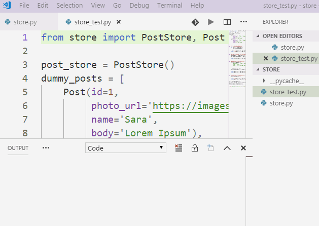

*مصدر الصورة: https://www.youtube.com/watch?v=wovbrTtFA8c*

### قمنا ببناء نصف مصنع الآيس الكريم

انتهينا في المهمة السابقة بعمل الدوال get_all و get_by_id و add

بقي الآن الدالتين update و delete حسب ما لدينا:

```python
class Post:
    def __init__(self, id, photo_url, name, body):
        self.id = id
        self.photo_url = photo_url
        self.name = name
        self.body = body

posts = []

class PostStore:
    def get_all(self):
        # get all posts - الحصول على كل المنشورات
        return posts

    def add(self, post):
        # append post - إضافة منشور
        posts.append(post)

    def get_by_id(self, id):
        # search for post by id - id البحث عن منشور بالمعرف
        result = None

        for post in posts:
            if post.id == id:
                result = post
                break

        return result

    def update(self, id, fields):
       # update post data - id تعديل منشور بالمعرف

    def delete(self, id):
        # delete post by id - id حذف منشور بالمعرف
```

### كيف تعمل الدالة update ؟

الدالة update مبنية بهذا الشكل:

```python
def update(self, id, fields):
```

بحيث تأخذ id المنشور الذي تأخذ منه العنصر:

```python
post = self.get_by_id(id)
```

بالنسبة للـ fields فهو يحتوي على المتغيرات (الحقول) التي سنقوم بتحديثها, بحيث كل حقل يقابله القيمة الخاصة به, بهذا الشكل:

```python
updated_fields = {'field_name1': 'new_value1', 'field_name2': 'new_value2'}
```

ويمكن الوصول للقيمة `new_value1` بكتابة `updated_fields['field_name1']`

ولتحديث عنصر المنشور post object داخل الدالة update نكتب:

```python
post.name = fields['name']
post.photo_url = fields['photo_url']
post.body = fields['body']
```

## كيف نستعمل الدالة update ؟

في حالة أردنا تحديث منشور سنجعله بهذا الشكل:

```python
updated_fields = {'name': 'Maryam',
                  'photo_url': 'https://images.pexels.com/photos/736716/pexels-photo-736716.jpeg?auto=compress&cs=tinysrgb&dpr=1&h=100&w=100',
                  'body': 'Lorem Ipsum'}
```

ثم نقوم بتمرير هذا المتغير إلى الدالة update:

```python
store.update(1, updated_fields)
```

## ماهي المهمة المطلوبة ؟

قم بملئ أكواد الدوال update و delete, بحيث تقوم كل دالة بوظيفتها حسب الوصف بداخلها.

## كيف أجرب الدوال التي كتبتها ؟

لتجربة الدوال ببساطة تدخل على الـ **CMD** أو terminal, وتكتب **الأمر python** الذي سيدخلك على موجه سطر أوامر بايثون, ثم تقوم بتجربة الدوال بهذا الشكل:

```python
# add posts
>>> from store import Post, PostStore
>>> post1 = Post(id=1,
             photo_url='https://images.pexels.com/photos/415829/pexels-photo-415829.jpeg?auto=compress&cs=tinysrgb&dpr=2&h=50&w=50',
             name='Sara',
             body='Lorem Ipsum')
>>> post2 = Post(id=2,
             photo_url='https://images.pexels.com/photos/736716/pexels-photo-736716.jpeg?auto=compress&cs=tinysrgb&dpr=1&h=100&w=100',
             name='John',
             body='Lorem Ipsum')
>>> store = PostStore()
>>> store.get_all()
[]
>>> store.add(post1)
>>> store.add(post2)
>>> store.get_all()
[<store.Post object at 0x000000462B35E5C0>, <store.Post object at 0x000000462B35E6A0>]

# update
>>> store.get_by_id(1).name
'Sara'
>>> updated_fields = {'name': 'Maryam',
                      'photo_url': 'https://images.pexels.com/photos/736716/pexels-photo-736716.jpeg?auto=compress&cs=tinysrgb&dpr=1&h=100&w=100',
                      'body': 'Lorem Ipsum'}
>>> store.update(1, updated_fields)
>>> store.get_by_id(1).name
'Maryam'

# delete
>>> store.get_all()
[<store.Post object at 0x000000F40B4FE588>, <store.Post object at 0x000000F40B4FE7B8>]
>>> store.delete(1)
>>> store.get_all()
[<store.Post object at 0x000000F40B4FE7B8>]
```

راجع الدرس السابق في كيفية كتابة هذه الأكواد على terminal أو CMD.

## كيف أختبر الحل خاصتي ؟

يجب عليك تحديث الملف store_test.py (الأكواد تحتوي على اختبار الدوال update و delete)

في حالة كانت أكوادك تعمل بشكل سليم ستظهر الرسالة All tests passed successfully

```python
from store import PostStore, Post

post_store = PostStore()
dummy_posts = [
    Post(id=1,
         photo_url='https://images.pexels.com/photos/415829/pexels-photo-415829.jpeg?auto=compress&cs=tinysrgb&dpr=2&h=50&w=50', 
         name='Sara', 
         body='Lorem Ipsum'),
    Post(id=2,
         photo_url='https://images.pexels.com/photos/736716/pexels-photo-736716.jpeg?auto=compress&cs=tinysrgb&dpr=1&h=100&w=100', 
         name='John', 
         body='Lorem Ipsum'),
]


def store_should_add_posts():
    for post in dummy_posts:
        post_store.add(post)
    
    # check if posts list has same length as dummy_posts list
    assert len(post_store.get_all()) == len(dummy_posts)


def get_by_id_should_retrieve_same_object():
    second_post = dummy_posts[1]
    retrieved_second_post = post_store.get_by_id(2)

    assert second_post is retrieved_second_post


def update_should_modify_object():
    fields_to_update = {
        'photo_url': 'https://images.pexels.com/photos/415829/pexels-photo-415829.jpeg?auto=compress&cs=tinysrgb&dpr=2&h=750&w=1260',
        'name': 'Alex', 
        'body': 'Interesting topic right here!'
    }

    # update second post
    post_store.update(2, fields_to_update)
    
    assert post_store.get_by_id(2).name == 'Alex'
    assert post_store.get_by_id(2).body == 'Interesting topic right here!'


def delete_should_remove_object():
    post_store.delete(2)

    assert len(post_store.get_all()) == 1
    assert post_store.get_all()[0].id == 1

store_should_add_posts()
get_by_id_should_retrieve_same_object()
update_should_modify_object()
delete_should_remove_object()

print('All tests passed successfully!')
```

لتشغيل هذه الاختبارات ببساطة تقوم بكتابة `python store_tests.py` في CMD أو تقوم بتشغيل الملف مباشرة على PyCharm.

## مثال على كتابة الكلاس بشكل صحيح

عندما تنتهي من كتابة الملف store.py بإمكانك تشغيل ملف store_tests.py مباشرة (كما في الصورة)



في حالة لم تظهر الرسالة (أو ظهرت رسالة أخرى), فهذا يعني أنه يجب أن تصلح الكود خاصتك في ملف store.py

## كيف تقوم بمشاركة الحلول ؟

بإمكانك مشاركة الحلول في مجتمع كورتابز على هذا الرابط:

<a href="https://forums.coretabs.net/t/مشاركة-حلول-انهاء-مستودع-للمنشورات-post-store/1369" style="display: block; width: 200px; background-color: #5355e8; background-image:linear-gradient(to left, #2d43e7, #9042e8); color:#fff; padding: 10px; margin: 30px auto; border-radius:100px; text-decoration: none; font-size: 18px; text-align: center;">مشاركة الحل</a>