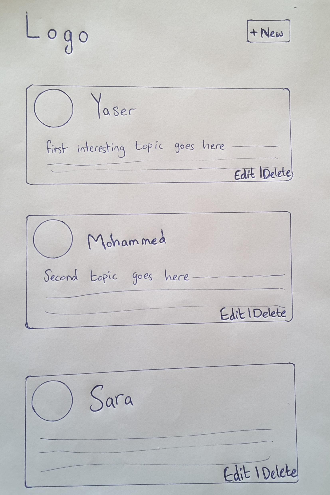

## لنفترض أن لدينا الوايرفريم التالي

كما اتفقنا سابقاً أن الوايرفريم يحتوي على المتطلبات والبيانات التي نحتاجها في المشروع.

لنفترض أن لدينا الوايرفريم التالي للمشروع الذي نريد القيام به (تطبيق مشابه للفيسبوك في عرض المنشورات):

## ماهي المهمة المطلوبة ؟

قم بكتابة model (نموذج) للبيانات التي بالأعلى, بحيث كل مربع يحتوي على منشور Post.

## كيف تقوم بمشاركة الحلول ؟

قم بتحديث المستودع خاصتك على github, وشاركنا رابط المشروع.

بإمكانك مشاركة الحلول في مجتمع كورتابز على هذا الرابط:

<a href="https://forums.coretabs.net/t/مشاركة-حلول-تجنب-النسخ-واللصق-باسخدام-الدوال/1159" style="display: block; width: 200px; background-color: #5355e8; background-image:linear-gradient(to left, #2d43e7, #9042e8); color:#fff; padding: 10px; margin: 30px auto; border-radius:100px; text-decoration: none; font-size: 18px; text-align: center;">مشاركة الحل</a>