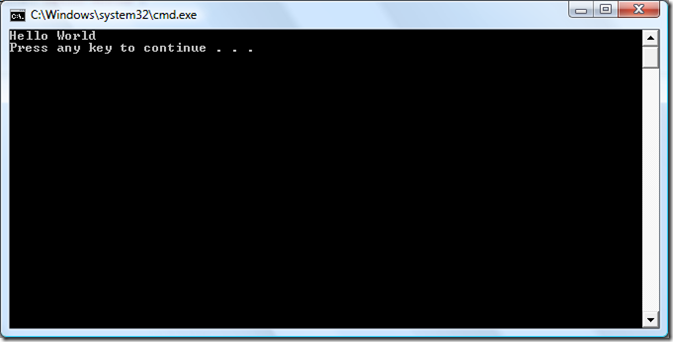
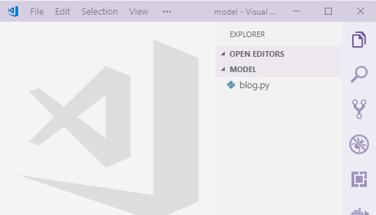

### ماهي برمجيات الكونسول console applications ؟

هي أبسط شكل من البرمجيات, بحيث نقوم بتشغيلها في الواجهة السوداء أو ما يعرف بـ Terminal أو CMD كما بالصورة في الأعلى.

### هل تتذكر كيف كنا نقوم بتشغيل ملفات python ؟

لنفترض أن لدينا الأمر التالي:

```python
print('hello')
```

وقمنا بحفظه على ملف اسمه `my_app.py`

كنا نقوم بفتح CMD أو terminal في VSCode ثم نكتب

```python
python my_app.py
```

ليظهر لدينا بهذا الشكل:



لاحظ أننا نقوم بتشغيل برامج البايثون على الواجهة السوداء أو ما يعرف **بموجه الأوامر CMD**, لهذا تسمى هذه البرمجيات Console Applications.

## لما لا نقوم بعمل الموقع مباشرة, بدلاً من البدء بعمل console app ؟

لأننا نريد أولاً فهم كيف نقوم بعمل برمجية بايثون **بدون الخوض في واجهات الويب** والتفاصيل المتعلقة بها.

بمجرد أن ننتهي من عمل console app, سنقوم بتحويله إلى موقع أنيق يتعامل معه المستخدمين من خلال الواجهة في المتصفح.

## لنبدأ مباشرة :wink: 

* مصدر صورة console app: https://blogs.msdn.microsoft.com/saraford/2008/09/19/did-you-know-if-you-do-a-ctrlf5-on-a-console-application-the-console-stays-open-317/