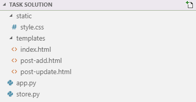
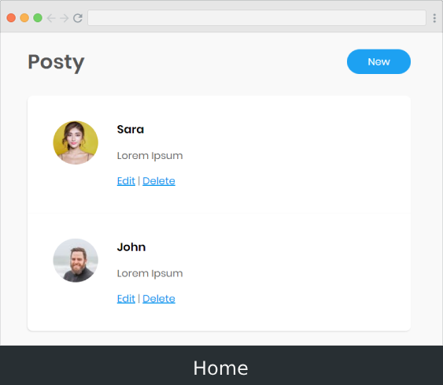
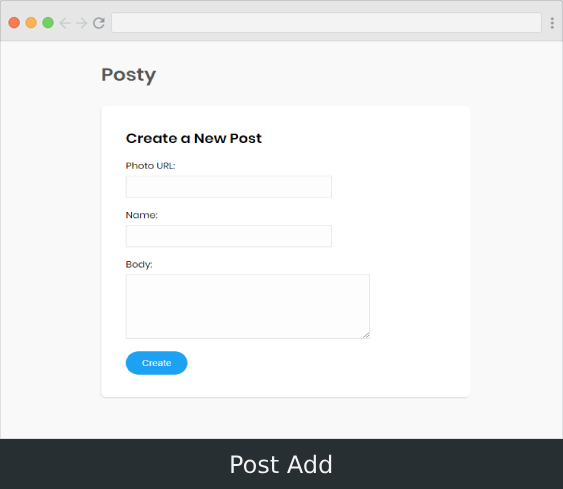
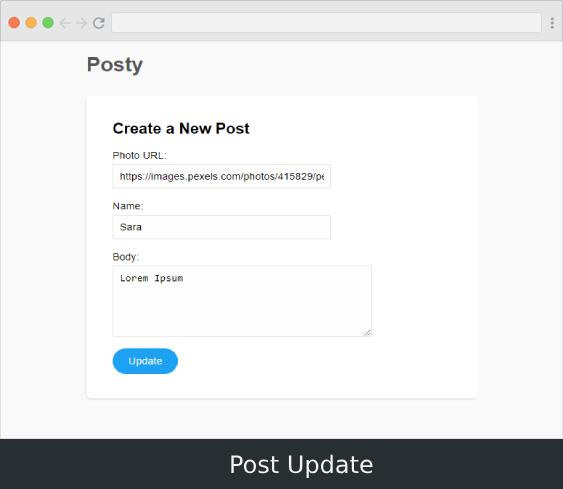

## ستايل (تنسيقات) الموقع

كما عرفنا أن عمل ستايل للموقع هو وظيفة مصمم الواجهات الأمامية (frontend designer).

قام زملائنا في مسار الـ frontend بتجهيز ستايل الموقع لنا, بإمكاننا استعماله مباشرة. ولكن, نحتاج فقط لتجهيز الصفحة و**جعلها ديناميكية باستعمال jinja**.

## أين أجد الموقع مع الستايل ؟

بإمكانك تحميل الملف من هذا الرابط:

[https://raw.githubusercontent.com/coretabs-academy/facebook-like-app/master/deploy-your-app/last-touches-task/assets/styling-assets.zip](https://raw.githubusercontent.com/coretabs-academy/facebook-like-app/master/deploy-your-app/last-touches-task/assets/styling-assets.zip)

ستجد داخله الثلاثة الملفات التالية:

1. الصفحة الرئيسية index.html
2. صفحة إضافة منشور post-add.html
3. ملف الستايل (التنسيقات) style.css

هذه الصفحات ستاتيكية (ثابتة), بإمكانك فتحها في المتصفح مباشرة.

## كيف تم فصل ملف الستايل عن ملفات html ؟

ببساطة, تم ربط ملف index.html بملف التنسيقات style.css في الـ head:

```html
<link href="style.css" rel="stylesheet">
```

نفس الأمر مع ملف post-add.html

## كيف نجعل الصفحة ديناميكية ؟

أول شيء يجب أن تنسخ ملفات html إلى المجلد templates, ثم تغيير البيانات الستاتيكية للمنشورات باستعمال jinja, مثلاً هكذا تقوم بجعل الصورة ديناميكية:

```html

    <article>
        <div>
            
        </div>
     </article>

```

ثانياً, يجب أن تقوم بتغيير رابط ملف الستايل style.css ليصبح بهذا الشكل:

```html
<link href="{{ url_for('static', filename='style.css') }}" rel="stylesheet">
```

بحيث نحن نخبر flask أن تبحث في **مجلد static** عن الملف style.css

## أين المجلد static, وعلى ماذا يحتوي ؟

مجلد static هو المجلد الذي سيحتوي على ملف التنسيقات style.css (قم بعمل المجلد ونسخ ملف التنسيقات إليه).

بحيث سيصبح لديك الملفات التالية:



## بقي صفحة تعديل المنشور post-update.html أين ذهب ؟

كما قلنا أن ملف post-update.html مشابه للملف post-add.html, بإمكانك كتابة الملف بسهولة :wink: 

## ماهي المهمة المطلوبة ؟

1. انسخ الصفحات والستايلات

2. قم بجعل الصفحات ديناميكية

3. تأكد من ظهور جميع الصفحات بشكل سليم

## كيف يجب أن تظهر الصفحات ؟

1. الصفحة الرئيسية



2. صفحة إضافة منشور



3. صفحة تعديل منشور




## كيف تقوم بمشاركة الحلول ؟

بإمكانك مشاركة الحلول في مجتمع كورتابز على هذا الرابط:

&lt;a href="https://forums.coretabs.net/t/مشاركة-حلول-تجنب-النسخ-واللصق-باسخدام-الدوال/1159" style="display: block; width: 200px; background-color: #5355e8; background-image:linear-gradient(to left, #2d43e7, #9042e8); color:#fff; padding: 10px; margin: 30px auto; border-radius:100px; text-decoration: none; font-size: 18px; text-align: center;"&gt;مشاركة الحل&lt;/a&gt;