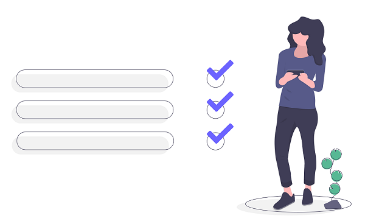

## انتهيت من إطلاق المشروع بنجاح !

عرفنا في هذه الورشة العديد من الأمور حول:

1. عمل model
2. عمل مستودع store للتحكم بالبيانات
3. بناء موقع الكتروني باستعمال flask
4. عمل صفحات مواقع الكترونية بلغة HTML 
5. إطلاق المشروع على هيروكو

## أصبحت الآن جاهز للعمل مع مطور آخر

في الورشة القادمة سنقوم بالعمل مع مطوري frontend لعمل تطبيقات مشتركة :wink: