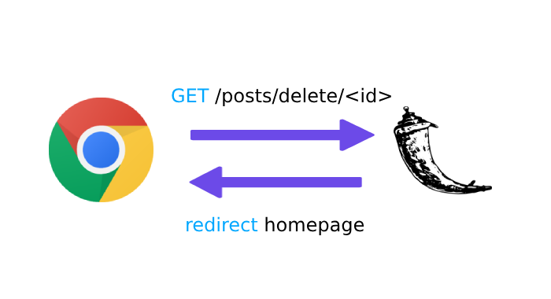
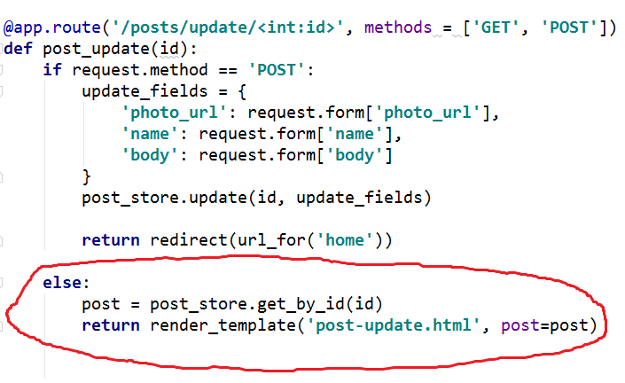
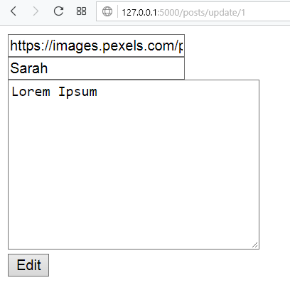
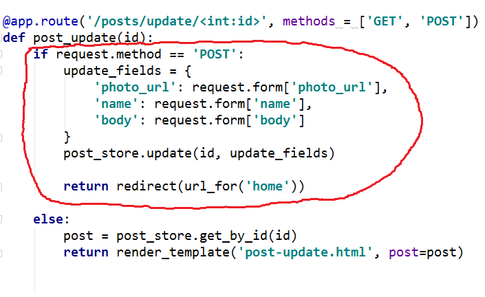
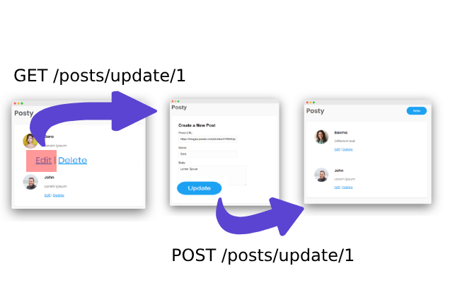

## الموقع صار يقوم بالمطلوب <span style="font-size: 26px;">:confetti_ball:</span>

أضفنا في المهام الثلاث الأخيرة:

1. آلية إضافة منشور add post
2. آلية حذف منشور delete post
3. آلية تعديل منشور update post

## كيف تعمل آلية حذف المنشور delete post


<em>مصدر الصورة: https://giphy.com/gifs/kids-how-diet-wCqeZS6Rlzn2g</em>

أول شيء نقوم به عند عرض المنشورات هو إضافة روابط الحذف لكل منشور في صفحة index.html عن طريق:

```html
<div>
    <h2>{{post.name}}</h2>
    <p>{{post.body}}</p>
    <div class="btn-section">
        <a href="{{ url_for('post_update', id=post.id) }}">Edit</a> |
        <a href="{{ url_for('post_delete', id=post.id) }}">Delete</a>
    </div>
</div>
```

تحديدا, السطر الذي نتحدث عنه هو

```html
<a href="{{ url_for('post_delete', id=post.id) }}">Delete</a>
```

أي حينما يضغط المستخدم على زر حذف المنشور الأول سيضغط على الرابط:

```
http://127.0.0.1/posts/delete/1
```

ورابط حذف المنشور الثاني هو:

```
http://127.0.0.1/posts/delete/2
```

### أي أن لكل منشور رابط حذف مختلف, لكن ماهو السبب ؟

السبب ببساطة, هو أننا كل مرة نرسل id (رقم مميز) خاص بكل منشور في دالة url_for, نمرر `id = post.id` وهذا لكي نحدد ماهو المنشور الذي نريد حذفه بالضبط.

بدون الـ id, السيرفر سيصاب بحيرة من أمرة ولن يعرف ماهو المنشور الذي سيحذفه <span style="font-size: 26px;">:thinking:</span>

ولدينا في الـ route قاعدة محددة لإستقبال هذا النوع من الطلبات (مع id), وهي `@app.route('/posts/delete/<int:id>')`

أي كل مرة سيضغط المستخدم في الصفحة على زر حذف المنشور, سيقوم المتصفح بإرسال الطلب:

```
GET /posts/delete/<id>
```

### حسناً, المتصفح سيرسل الطلب `GET /posts/delete/<id>` لكن ماهو الرد response ؟

كما نعرف أن أي request يرسله المتصفح له رد response من جهة السيرفر.

لذا, نحن قمنا بعمل الدالة post_delete بهذا الشكل:

```python
@app.route('/posts/delete/<int:id>')
def post_delete(id):
    post_store.delete(id)
    return redirect(url_for('home'))
```

وهي ستقوم بإعادة توجيه redirect للصفحة الرئيسية home حسب السطر `redirect(url_for('home'))`



### لكن, لماذا نجعل المستخدم يعود redirect للصفحة الرئيسية, وهو أصلاً كان في نفس الصفحة ؟

في الواقع نحن لا نريد إعادة توجيهه, ولكن فقط نحن نقوم بعمل تحديث refresh للصفحة لجلب قائمة المنشورات مجدداً (كون أحدها تم حذفه)	<span style="font-size: 26px;">:slightly_smiling_face:</span>

## الأمر مختلف قليلاً مع تعديل المنشور update post

يمكن الاختلاف في الأمر أن تعديل المنشور هو مثل إضافة منشور, ولكن يلزمنا الـ id الخاص بالمنشور.

### مالذي يحدث حينما يضغط المستخدم على زر edit للمنشور

لنفترض أن المستخدم ضغط على تعديل المنشور الأول, في هذه اللحظة سيقوم المتصفح بارسال طلب:

```
GET /posts/update/1
```

الرقم 1 هو الـ id الخاص بهذا المنشور... لكن, لما نرسل الـ id ؟

أنت تعرف مسبقاً, لأننا نحتاج أن نعرف ماهو المنشور الذي نريد تعديله, والشيء المميز الوحيد لدينا هو الـ id.

### ماهو الجزء الذي سيتم تنفيذه على الأكواد ؟

عندنا هذه الدالة التي تقوم بتحديث المنشور:

```python
@app.route('/posts/update/<int:id>', methods = ['GET', 'POST'])
def post_update(id):
    if request.method == 'POST':
        update_fields = {
            'photo_url': request.form['photo_url'], 
            'name': request.form['name'], 
            'body': request.form['body']
        }
        post_store.update(id, update_fields)

        return redirect(url_for('home'))

    else:
        post = post_store.get_by_id(id)
        return render_template('post-update.html', post=post)
```

الجزء المهم لدينا هنا هو الذي يستقبل طلب GET وهو هذا الجزء:



بالتأكيد هذا سيظهر لنا الصفحة التالية على المتصفح



### كيف سيستقبل السيرفر الجزء الآخر POST, ومتى يحصل هذا ؟

عندما يضغط المستخدم على زر Update في الموقع, مباشرة سيقوم المتصفح بارسال طلب `POST /posts/delete/<id>`

وسيرفر فلاسك بدوره سيشغل الأكواد التالية:



وهي تقوم بعمل التعديلات على عنصر المنشور post object, ثم تقوم بإعادة توجيه المستخدم على الصفحة الرئيسية في السطر `redirect(url_for('home'))`

#### الأمر يجري بشكل منتظم الخطوة الأولى هي GET وإظهار صفحة التعديلات, يتبعها الخطوة التالية POST والرجوع للصفحة الرئيسية (كما في الصورة)



## الموقع صار شبه جاهز... لنقم بإطلاقه !