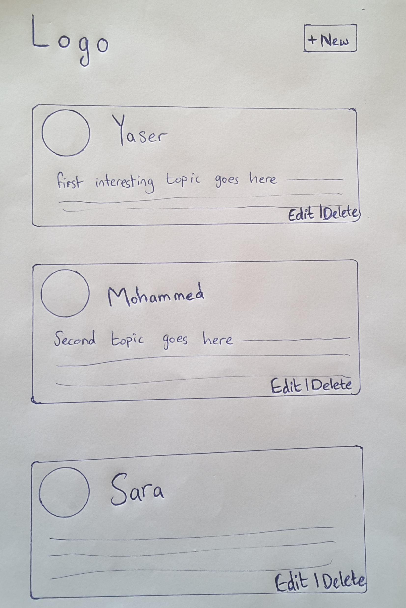

## لنفترض أن لدينا الوايرفريم التالي

كما اتفقنا سابقاً أن الوايرفريم يحتوي على المتطلبات والبيانات التي نحتاجها في المشروع.

لنفترض أن لدينا الوايرفريم التالي للمشروع الذي نريد القيام به (تطبيق مشابه للفيسبوك في عرض المنشورات):

## ماهي المهمة المطلوبة ؟

قم بعمل ملف index.html الذي يحتوي على بيانات الوايرفريم بالأعلى.

## كيف تقوم بمشاركة الحلول ؟

لا داعي لعمل مستودع, بإمكانك مشاركة الأكواد مباشرة على المنتدى :wink:

بإمكانك مشاركة الحلول في مجتمع كورتابز على هذا الرابط:

<a href="https://forums.coretabs.net/t/مشاركة-حلول-صفحة-المنشورات-html/1362" style="display: block; width: 200px; background-color: #5355e8; background-image:linear-gradient(to left, #2d43e7, #9042e8); color:#fff; padding: 10px; margin: 30px auto; border-radius:100px; text-decoration: none; font-size: 18px; text-align: center;">مشاركة الحل</a>