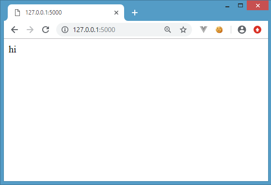
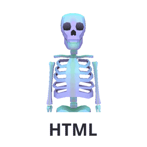
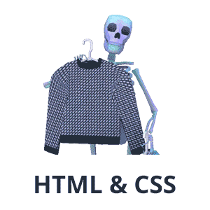
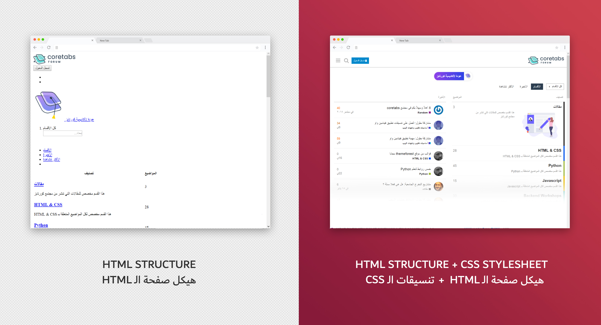

## مالذي قمنا بعمله ؟

قمنا بعمل سيرفر باستعمال flask, يقوم بعرض الرسالة hi على المتصفح.

والآن, نريد عمل صفحات ويب كالتي نراها في المواقع الإكترونية الأخرى.

## لكن, كيف نقوم بعمل صفحات ويب ؟

نحتاج أن نستعمل **لغة HTML**.

هي اختصار لـ Hyper Text Markup Language, وفي الحقيقة **لا تصنف كلغة برمجة** بل كلغة توصيف فهي تقوم بعمل **توصيف** لمحتويات الموقع ولا تستطيع القيام بعمل وظيفي كالقيام بالعمليات الحسابية.

تعتبر HTML وحدة البناء الأساسية للموقع (هيكل الموقع).

## لغة HTML تهتم بالهيكل, ماذا عن الستايل (التنسيقات) ؟

للقيام بتنسيق الصفحات, نستعمل **لغة CSS**.

هي اختصار لـ Cascading Style Sheet و هي لغة تصميم المواقع والمعنية **بإضافة التنسيقات لهيكل الصفحة** من حيث لون الخلفية او نوع الخط على سبيل المثال.

## إذاً, ماهو الفرق بين HTML وCSS ؟

نستطيع أن نقول بأن لغة HTML هي المسؤولة عن هيكلة و وضع محتوى الموقع بينما CSS هي اللغة المسؤولة عن تصميم وتنسيق هذه المحتويات.

### لنأخذ مجتمع كورتابز كمثال

## هل أحتاج أن أتعلم كلاً من HTML وCSS كوني مطور backend ؟

تحتاج أن تتعلم HTML, للقيام بعمل هياكل الصفحات, ولكن ليست وظيفتك أن تقوم بعمل ستايل الصفحة باستعمال CSS, وإنما هو دور مصمم الويب frontend designer.

لذلك سنركز فقط على أساسيات HTML, وفي حال أحببت تعلم البقية عمل تنسيقات الصفحات, بإمكانك الخوض في مسار frontend... أنصحك الآن بالتركيز على مسار backend, بإمكانك الخوض في المسار الآخر بعد الانتهاء من هذا المسار  :wink: