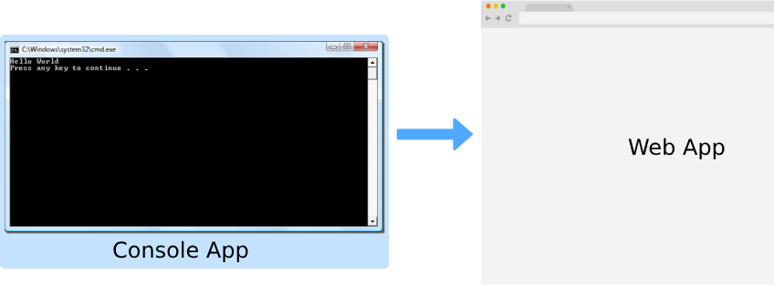

## بناء موقع الكتروني

هذه المرة سنقوم بتحويل console app إلى web app

## ماهو الفرق بين console app و web app ؟

ببساطة الـ web app هو تطبيق يتم الوصول إليه عن طريق المتصفح ولديه واجهة يتعامل معها المستخدم, بكلمات أخرى: **موقع إلكتروني**.

أما الـ console app فهو ما عرفنا أنه يعمل في الواجهة السوداء CMD أو terminal.

## كيفية سنقوم بتحويل الـ console app خاصتنا إلى web app ؟

بداية سنحتاج إلى framework للقيام بهذا.

## ماهي الـ framework (إطار عمل) ؟

هي برمجية تقوم ببناء برنامجك باستعمالها, صممت خصيصاً لتوفير الوقت لك للقيام **بمهام مشتركة** في البرمجيات الأخرى.

مثلاً ماهي الأشياء المشتركة في مجال الويب ؟

1. تسجيل مستخدم user registration.
2. التعامل مع قواعد البيانات.
3. استقبال الطلبات لفتح صفحة معينة.
.. إلخ

بالتأكيد لن تقوم بكل هذا العمل بنفسك, وستوفر لك الـ web framework (إطار عمل الويب) كل هذه الأمور وأنت فقط ستبني برنامجك على الطريقة التي يخبرك بها مصمم الـ framework.

## ماهي الفريمورك framework التي سنقوم باختيارها لهذا المشروع ؟

بما أننا نستعمل بايثون فيوجد لدينا اثنين خيارات هي الأشهر:
1. flask
2. django

في هذا المشروع **قررنا استعمال flask**.

أنا هنا لا أقول أن flask أفضل من django, ولكن flask سيجعل الأمور أوضح وأسهل في الفهم.

## جاهز لعمل أول موقع الكتروني لك ؟

لنقم بذلك حالاً :wink: 