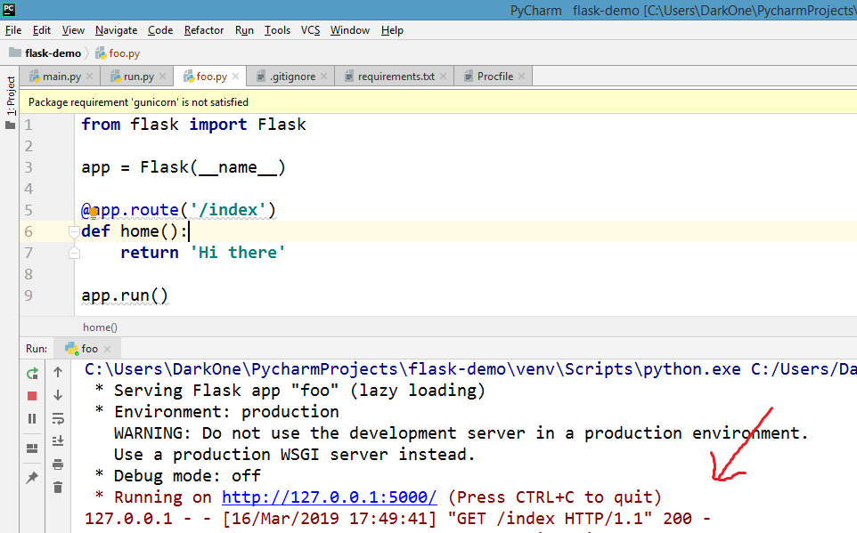
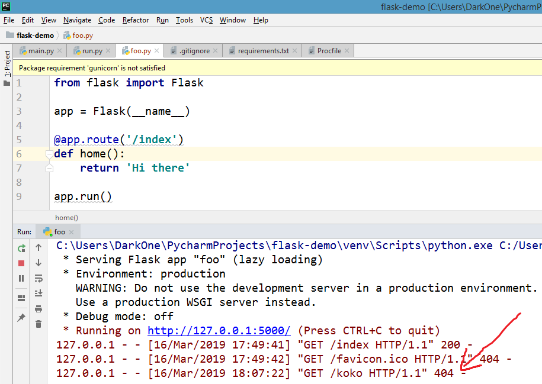

## مالذي قمنا بعمله ؟

قمنا بكتابة الأسطر:

```python
from flask import Flask

app = Flask(__name__)

@app.route('/index')
def home():
    return 'Hi there'

app.run()
```

والتي تعني:

> قم باستقبال الطلبات (requests) على الرابط `/index` ولكن من النوع GET

## ماهو طلب GET (أو ما يعرف به GET request) ؟

يوجد لدينا أنواع كثيرة من الطلبات تعرف بـ HTTP Verbs (أفعال HTTP).

إحدى هذه الأنواع هي GET, والتي تعني "**اجلب**"... من اسمها.

يوجد طلبات أخرى مثل **POST لإنشاء** عنصر, أو **DELETE لحذف** عنصر, سنتعرف عليها مستقبلاً <span style="font-size: 26px;">:wink:</span>

## هممم... ولكن, كيف عرف flask أننا نريد GET ؟

بطبيعة الحال, flask تقوم بإضافة البارامتر `methods = ['GET']` والذي يقوم باستقبال طلبات GET... أي أنك حينما تكتب:

```python
@app.route('/index')
def home():
    return 'Hi there'
```

ستقوم فلاسك بترجمتها إلى:

```python
@app.route('/index', methods = ['GET'])
def home():
    return 'Hi there'
```

## ماهو المهم أن تعرفه ؟

المهم أن تعرفه أن المتصفح يقوم بالطلبات باستعمال HTTP Verb ورابط URL بهذا الشكل:

```
GET /index
```

## إذا حينما يرسل المتصفح طلب GET مالذي يحصل عليه بالمقابل ؟

هنا يأتي دور الرد **response** بحيث يقوم التطبيق الذي كتبناه بارجاع النص Hi there, لاحظ مالذي سيحدث في pycharm عند تشغيل سيرفر فلاسك server flask:



```
"GET /index HTTP/1.1" 200
```

معناه أنه استقبل طلب `GET /index` و**الرد response هو 200**.

## لكن, ماهو معنى 200 ؟؟

في الواقع 200 هو كود (status code) يرسله السيرفر للمتصفح لكي يخبره أنه تم كل شيء تم بشكل سليم, ويعرف أيضاً هذا الكود بـ **200 OK**.

وبالفعل هذا الكود يأتي مع النص Hi there, أي أن السيرفر يخبر المتصفح بأن كل شيء تم بشكل سليم وأيضاً يرسل له الرد الذي نكتبه في الدالة.

## هممم... إذا كتبنا رابط غير موجود على المتصفح مالذي سيرجعه السيرفر ؟

الآن نحن نستقبل فقط `GET /index`, بمعنى إذا كتبنا في المتصفح:

```
http://127.0.0.1:5000/koko
```

وهو رابط اعتباطي (بإمكانك كتابة أي رابط آخر), سيرسل المتصفح الطلب `GET /koko`, مالذي سيحصل الآن ؟



لاحظ ماذا يظهر لنا في التطبيق, استقبل السيرفر الطلب, وقام بإرجاع الرد response الكود **404** الذي يعني غير موجود **Not Found**.

أي أن السيرفر يقول للمتصفح:

> أنا بحثت على الصفحة التي تريدها, لكن للأسف ما لقيتها (404) !

لاحظ أيضاً أن السيرفر طلب أيقونة الموقع `GET /favicon.ico`, لأن أي موقع يفترض أن يكون معه أيقونة, لكن سيرفرنا العزيز قال للمتصفح ما عندي أيقونة (404) <span style="font-size: 26px;">:smile:</span>

## هل يوجد أكواد أخرى status codes للرد response على المتصفح ؟

عرفنا الكود **200 OK** والكود الآخر **404 Not Found**, لكن بالتأكيد يوجد أكواد أخرى كثيرة.

سنتعرف على أنواع الأكواد وتفصيل حولها في الورشات القادمة <span style="font-size: 26px;">:wink:</span>