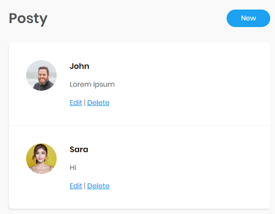

## مالذي سنقوم به في هذه الورشة ؟

سنقوم هذه المرة ببناء أول موقع فعلي لنا وسيكون مشابه للواجهة الرئيسية للفيسبوك (عرض المنشورات posts).

أيضاً سنتعرف على كيفية إطلاق المشروع على النت لكي يستطيع أصدقائك تجربة الموقع.

## ماهي الخطوات التي سنتخذها ؟

### 1. فهم المشروع ومتطلباته

بالتأكيد, هذه أول خطوة في أي مشروع تقوم به. يجب أن تفهم كل المطلوب منك حتى تقوم به بالشكل المناسب.

### 2. عمل تطبيق console

سنقوم أولاً بفهم كيفية عمل التطبيق على شكل console (شاشة سوداء كالعادة مع بايثون), لكي نفهم كيفية بناء التطبيق قبل تحويله على موقع.

### 3. تحويل تطبيق console إلى تطبيق ويب (موقع الكتروني)

سنقوم بعدها بتحويل التطبيق إلى موقع فعلي :wink:

## جاهز للرحلة ؟

أعتقد أنك جاهز... لنبدأ مباشرة بالعمل!