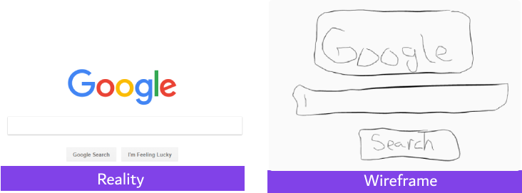

## لنفترض أنه طلب منك أن تقوم بعمل وايرفريم لموقع Google

## ماهي المتطلبات؟

1. نريد صفحة بحث, يكتب فيها المستخدم كلمات البحث, ثم يضغط على زر البحث.
2. صفحة البحث تحتوي على شعار الموقع.
3. بعد الضغط على زر البحث, تظهر نتائج البحث على شكل قائمة.
4. كل نتيجة لديها بعض التفاصيل بالأسفل.

## صفحة البحث

بإمكانك رسم الوايرفريم لصفحة البحث باستخدام الورقة والقلم, لاحظ الفرق بين الصفحة الحقيقية والوايرفريم.

## صفحة نتائج البحث

كما تلاحظ, حاول فقط أن تلم بكل المطلوب وتأكد من أن العميل يوافق على الوايرفريم قبل البدء بكتابة البرمجية.